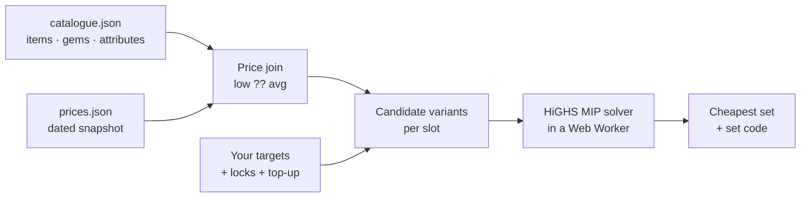

<div align="center">

# ⚔️ Mistfall Builder

**Find the cheapest Mistfall Hunter equipment set for the attribute levels you want.**

[](https://github.com/mvscottdev/mistfall-builder/actions/workflows/deploy.yml)
[](https://mvscottdev.github.io/mistfall-builder/)


[**Open the app →**](https://mvscottdev.github.io/mistfall-builder/)

</div>

---

> [!TIP]
> Two looks: **Forge** and **Mist**. Switch in the header, or add
> `?design=forge` / `?design=mist` to the URL.

## ✨ What it does

Pick your class, say which set bonuses you want and at what level, and the
builder works out the **lowest-gold combination** of items and gems that gets
you there. It runs entirely in your browser: no server, no account, no tracking.

| | |
|---|---|
| 🎯 **Targets** | Ask for any of the 32 set bonuses at any level. Tier thresholds are shown as you go. |
| 💰 **Cheapest set** | An exact optimiser (mixed-integer programming via [HiGHS](https://highs.dev/)) finds the minimum-cost set, not just a good one. |
| ➕ **Top-up** | Accounts for extra levels you can add on top of items, and uses them only when they save gold. |
| 🔒 **Locks** | Fix quality for the whole set or per slot, a weapon type, or the amulet/ring base. |
| 🗡️ **Second weapon** | Pick an off-hand base and quality, or leave it to the cheapest option. |
| 🔗 **Set codes** | Copy the result as an in-game import code, or paste a code to see its set and load it as your targets. |
| 🌐 **RU / EN** | Follows your browser language; your choice is remembered. |
| 📅 **Price date** | The date of the price snapshot is always visible. |

## 🧭 How it works



- **Data is a committed snapshot.** `public/data/` holds the item catalogue and
  prices. The page reads nothing else.
- **Heavy maths stays off the UI thread.** The solver runs in a Web Worker, so
  the page never freezes.
- **Calculate is explicit.** Changing inputs marks the result as stale; nothing
  is re-solved until you click Calculate.

## 📖 Words used here

| term | meaning |
|---|---|
| **Slot** | Equipment position: weapon, helmet, chest, bracers, pants, boots, amulet, ring. |
| **Quality** | Rare · Excellent · Epic · Legendary · Holy. Higher quality means more mod slots. |
| **Socket** | An empty mod slot with a shape; it takes a gem of the matching family. |
| **Attribute** | One of 32 set bonuses. Its level is the sum of contributions across the set. |
| **Target** | The final level you want for an attribute (overshooting is allowed). |
| **Top-up** | Extra levels added on top of items: a total pool plus a per-attribute cap. |
| **Budget** | The most levels the items can give for your class and locks; caps each target. |
| **Lock** | A constraint you set on quality, weapon type or jewellery base; the second weapon has its own type and quality locks. |
| **Set code** | The game's import string for a full set. |

## 💰 Updating prices

Edit `public/data/prices.json` (`updatedAt`, plus `low` / `avg` per item or gem
id) and push to `main`. The site rebuilds and redeploys automatically. An item
with no price is still known, but the solver won't pick it.

From a trade price dump (`{ "low": {id: gold}, "avg": {id: gold} }`):

```bash
node scripts/import-prices.cjs path/to/trade_prices.json --date 2026-10-07
```

## 🛠️ Development

Requires Node 24.

```bash
npm install
npm run dev
```

| command | does |
|---|---|
| `npm run dev` | local dev server |
| `npm test` | Vitest unit + golden tests |
| `npm run lint` | ESLint + Prettier check |
| `npm run format` | fix formatting |
| `npm run build` | type-check and build into `dist/` |

Before pushing: `npm run lint && npm test && npm run build`. CI runs the same
three steps on every push and pull request, and deploys `main` to GitHub Pages.

### Project layout

```
src/
  domain/      shared types: Item, Gem, Slot, Socket, Target, Set…
  catalogue/   load + validate the data snapshot, join prices
  solver/      candidate variants, MIP model, Web Worker
  setcode/     set code encode / decode
  store/       the app state (Zustand)
  i18n/        RU / EN strings
  components/  React UI
public/
  data/        catalogue.json, prices.json
  icons/       <iconId>.webp
tests/
  fixtures/    frozen inputs and expected answers (read-only)
scripts/       data maintenance (Node)
```

### Golden tests

`tests/fixtures/` holds frozen game data and the exact answers a proven earlier
version of the optimiser gave for a fixed set of scenarios. The new solver and
set code must reproduce them exactly. Because prices there are frozen, a real
price update never breaks a test. **Don't edit these files.** If a golden test
fails, the code is wrong, not the fixture.

### Stack

Vite · React · TypeScript (strict) · Tailwind CSS · Zustand · Motion · HiGHS
(WASM) · Vitest · ESLint · Prettier · GitHub Actions → GitHub Pages.

## 📄 License

None yet. The source is public, but all rights are reserved.

<div align="center"><sub>Fan-made tool. Not affiliated with the developers of Mistfall Hunter.</sub></div>
